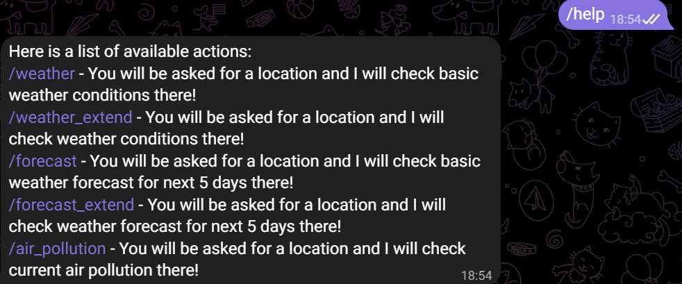
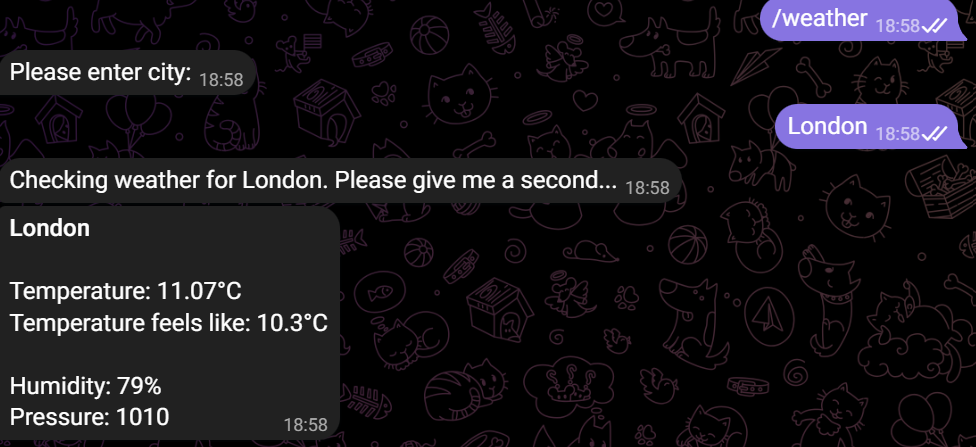
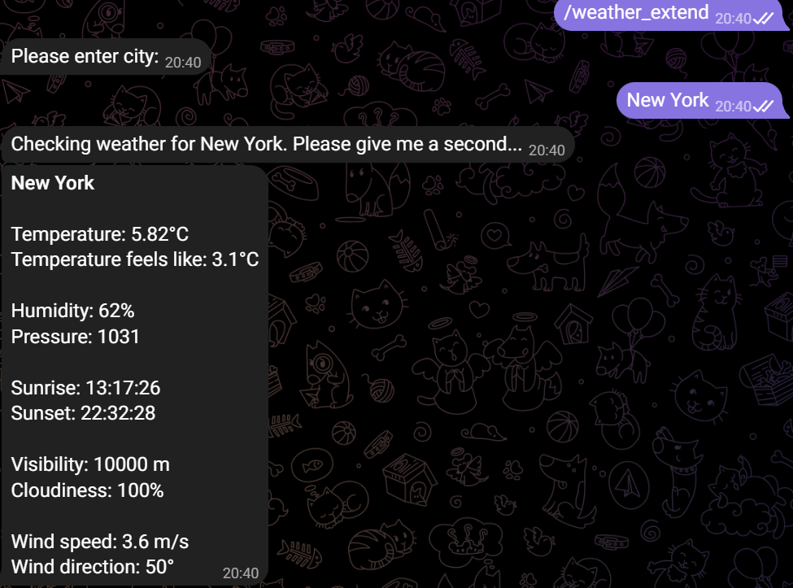
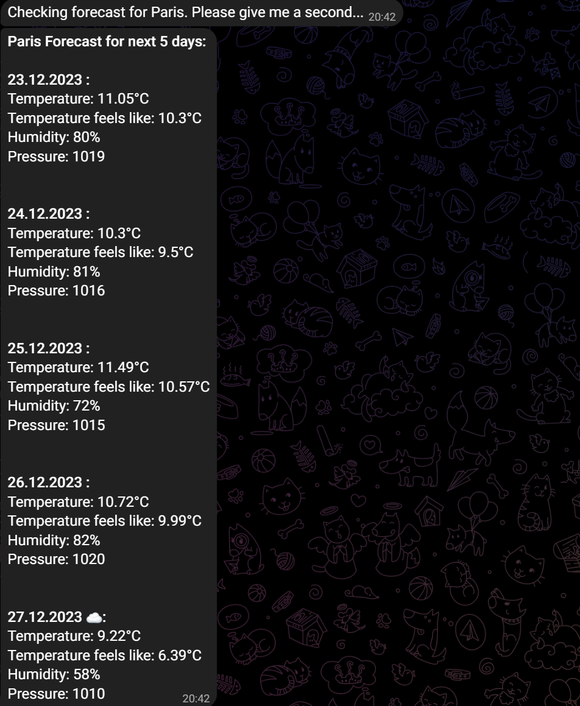
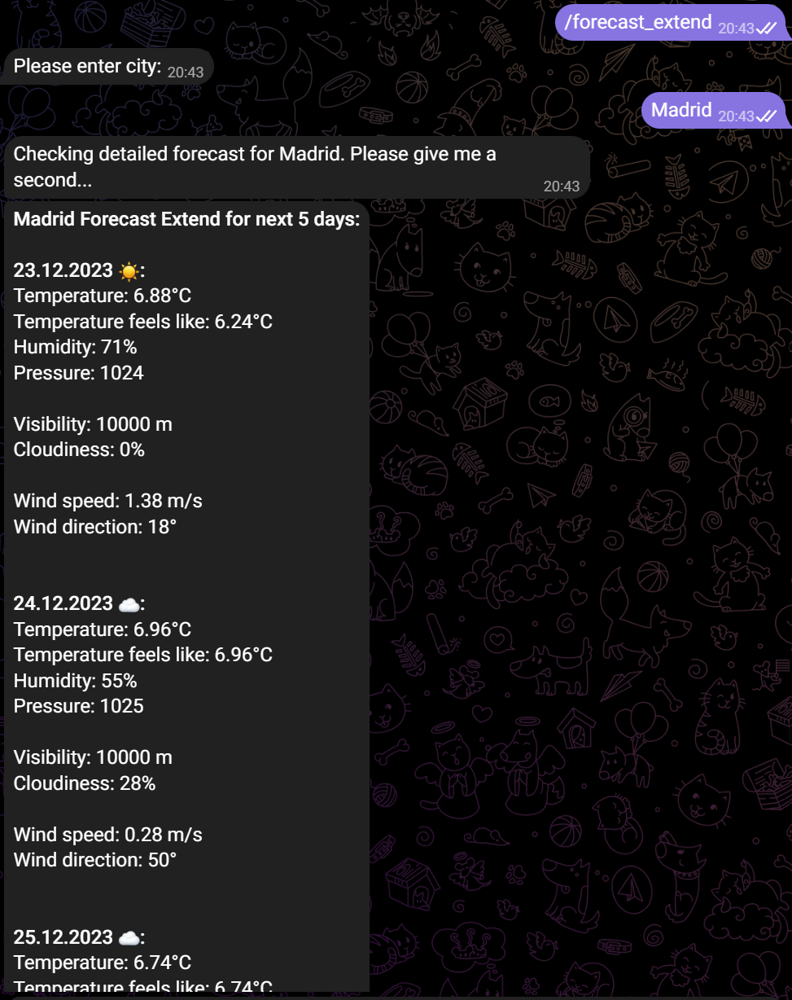
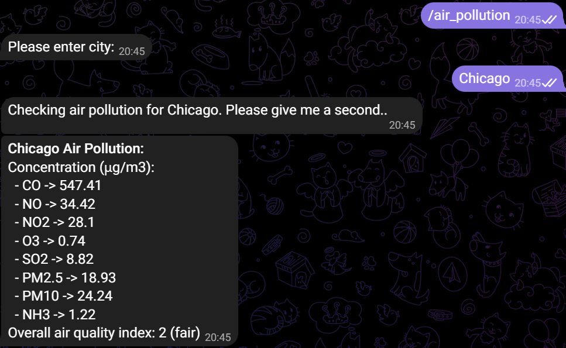
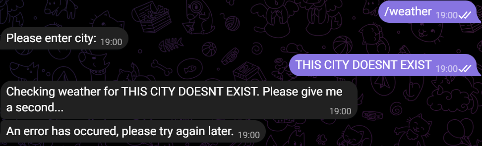

# Weather Telegram Bot

## What is this?

Weather Telegram Bot is a bot that can provide you with data about current weather, forecast and air pollution. There are six available commands:

- `/help` - it prints information about what bot is capable of
- `/weather` - it gives data about current weather:

```
Temperature (Celsius degrees)
Temperature feels like (Celsius degrees)
Humidity (%)
Pressure (hPa)
```

- `/weather_extend` - it gives detailed data about current weather, same as `/weather`, but with addition of

```
Sunrise (hour:minute:second)
Sunset (hour:minute:second)
Visibility (m)
Cloudiness (%)
Wind speed (m/s)
Wind direction (degrees)
Rain volume (mm) - from last hour (only if available in given location)
Snow volume (mm) - from last hour (only if available in given location)
```

- `/forecast` - it shows 5-day forecast

```
Temperature (Celsius degrees)
Temperature feels like (Celsius degrees)
Humidity (%)
Pressure (hPa)
```

- `/forecast_extend` - it shows 5-day detailed forecast, same as `/forecast`, but with addition of

```
Visibility (m)
Cloudiness (%)
Wind speed (m/s)
Wind direction (degrees)
```

- `/air_pollution` - it provides data about current air pollution

```
Overall air quality index (1-5, where 1 - good, 2 - fair, 3 - moderate, 4 - poor, 5 - very poor)
Concentration (μg/m3) of:
- CO
- NO
- NO2
- O3
- SO2
- PM2.5
- PM10
- NH3
```

For details about the data, how it is processed and how things are calculated please refer to [OpenWeather API Docs](https://openweathermap.org/api).

## Example of usage

- `/help`

  

- `/weather`

  

- `/weather_extend`

  

- `/forecast`

  

- `/forecast_extend`

  

- `/air_pollution`

  

- when bot cannot find provided city

  

## How was it built?

Weather Telegram Bot was built using typescript. It heavily depends on library [telegraf](https://github.com/telegraf/telegraf), which is "Modern Telegram Bot Framework for Node.js".
All of the data that is used by this bot is from [OpenWeather API](https://openweathermap.org/api) (free plan).

## How to run it?

Firstly, clone this repository.
To run this bot on your own you will need two things:

- [**Telegram Bot Token**](https://core.telegram.org/bots)
- [**Open Weather API Key**](https://openweathermap.org/api)

Once you have them, please create `.env` file in root directory of this repository, in which you should put:

```env
BOT_TOKEN=YOUR_BOT_TOKEN
OPEN_WEATHER_API_KEY=YOUR_API_KEY
```

After this, all you have to do is type:

```
npm run start
```

and you are good to go :).
